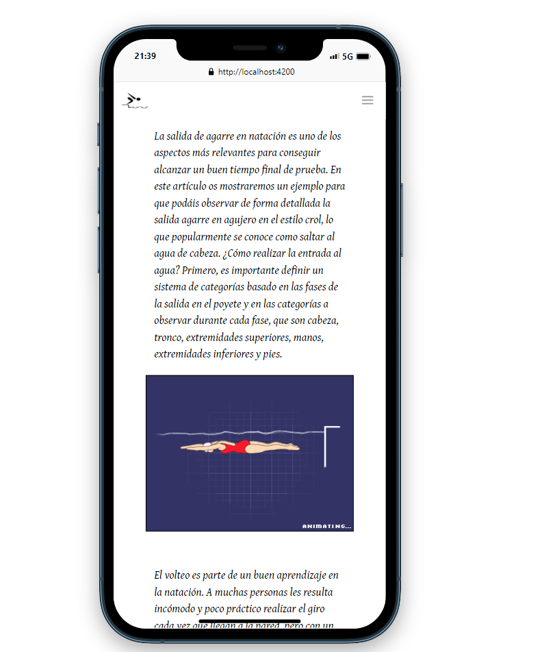

# swimming_app

To lovers of swimming --- App 🏊🏊

* Is total responsive with all dispositives 📱📲

* To have better performances try to signup & ENJOY IT 👨‍💻📎
---

--- 
## Application preview 📱

--- 
## Backend [server & api]
`nodeJs`

`bbdd with mongoDb`

`express & mongoose`

## Front
`Framework Angular`

## Styles
`sass`

`bulma.io`

`googleFonts`

--- 

REMEMBER
`npm i` before clone it

---

to run server (backend)

`npm run dev` 

to run front (ng serve --o)

`ng serve`

